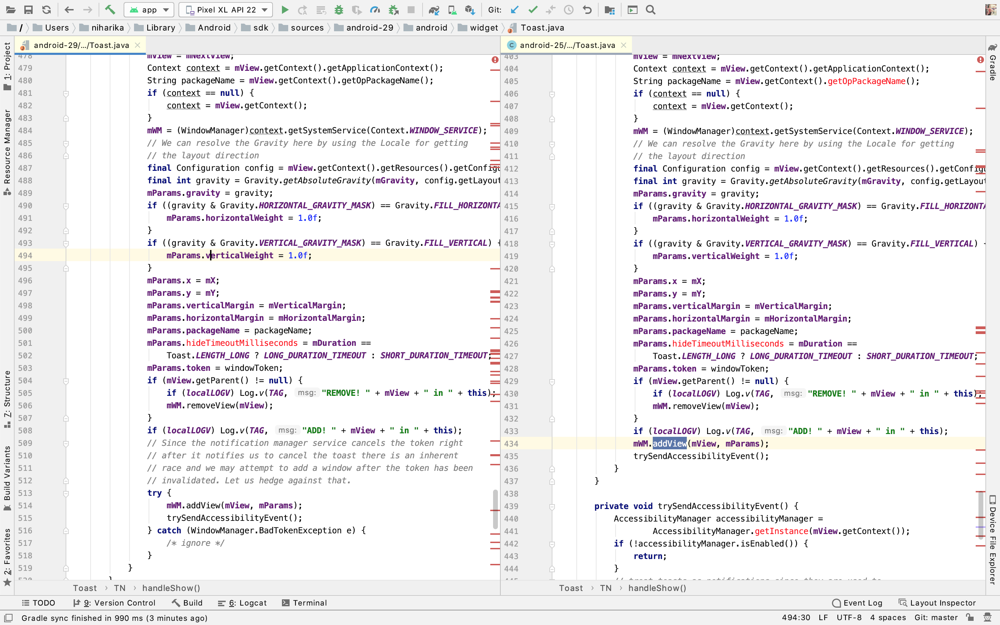

# ToastHandler
An Android library for handling Toast BadTokenException happening on Android API level 25 and showing Toast smoothly on All Android versions.


### Usage 

Add this to your app build.gradle:

```groovy
implementation 'com.toastfix:toastcompatwrapper:1.0.0'
```

Use this wherever you are showing Toast:

```java
ToastHandler.getINSTANCE().showToast(this, "Hello,I am Toast", Toast.LENGTH_SHORT);
```

Please refer the demo for usage.


### Why

From API 25, Android added a new param `IBinder windowToken` for `Toast#handleShow()`, and It brought an exception. 
As Android said on API 26: 

```java
// Since the notification manager service cancels the token right
// after it notifies us to cancel the toast there is an inherent
// race and we may attempt to add a window after the token has been
// invalidated. Let us hedge against that.
```

So they try-catch the `mWM.addView(mView, mParams)` on API 26. **However, API 25 is still at risk. Our applications will continue to produce such an exception, and can not capture it**: 

```java
Fatal Exception: android.view.WindowManager$BadTokenException: 
Unable to add window -- token android.os.BinderProxy@1c4411f is not valid; is your activity running?
       at android.view.ViewRootImpl.setView(ViewRootImpl.java:679)
       at android.view.WindowManagerGlobal.addView(WindowManagerGlobal.java:342)
       at android.view.WindowManagerImpl.addView(WindowManagerImpl.java:94)
       at android.widget.Toast$TN.handleShow(Toast.java:459)
       at android.widget.Toast$TN$2.handleMessage(Toast.java:342)
       at android.os.Handler.dispatchMessage(Handler.java:102)
       at android.os.Looper.loop(Looper.java:154)
       at android.app.ActivityThread.main(ActivityThread.java:6236)
       at java.lang.reflect.Method.invoke(Method.java)
       at com.android.internal.os.ZygoteInit$MethodAndArgsCaller.run(ZygoteInit.java:891)
       at com.android.internal.os.ZygoteInit.main(ZygoteInit.java:781)
```

This exception occurs regardless of whether the `Context` you passed to `Toast` is an `Activity` or `ApplicationContext` or `Service`. And you can not `try-catch` it. 
 
 See the detail diff of **Android Toast sources**: 



### How

So In this library ,I have created `ToastHandler` class which is responsible for showing Toast smoothly on all API versions and replaced the base Context to a `ToastContextWrapper`, it will hook the WindowManagerWrapper.addView(view, params) method and fix the exception.


